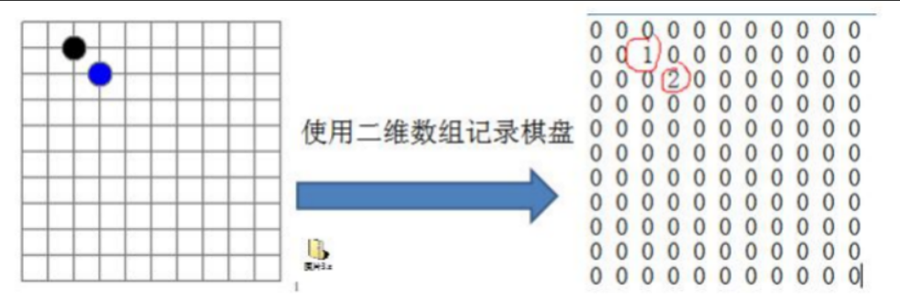

#### 1、分类
##### 1.1 线性结构
    数据元素之间存在一对一的线性关系
    线性结构有两种不同的存储结构，即顺序存储结构和链式存储结构。顺序存储的线性表称为顺序表，顺序表中的元素是连续的
    链式存储的称为链表，存储元素不一定是顺序，元素节点存放数据元素以及相邻元素的地址信息
    线性结构：数组，队列，链表和栈
##### 1.2 非线性结构
    二维数组，多维数组，广义表，树结构，图结构

#### 2、稀疏数组和队列 
五子棋中 存盘退出及续盘功能

二维数组很多默认值0, 记录了很多没有意义的数据 -> 稀疏数组

当一个数组中大部分元素为0，或者为同一个值的数组时，可以使用稀疏数组来保存该数组

处理方式：

1、记录数组有几行几列，有多少个不同的值

2、把不同值得元素行列及值记录在一个小规模的数组中，从而缩小程序的规模

稀疏数组数据结构：

​			row(行)	col(列)	value(值)

1行	  数据多少行  多少列  值不同个数

2行      行			 列			值

一般第1行 记录原始数组有多少行、列、值。			